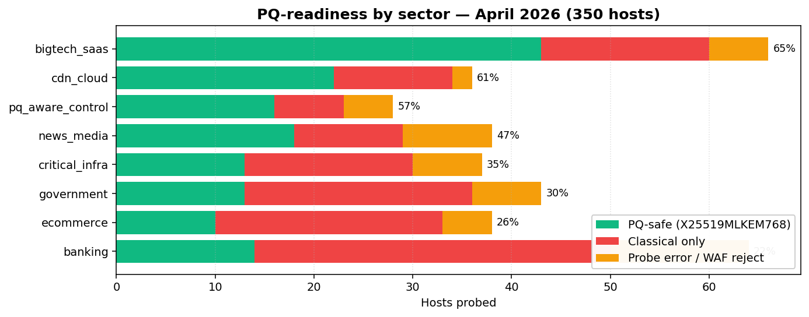

# PQ Readiness Index

> Independent, reproducible, annual measurement of post-quantum cryptography adoption across the public internet.

[](./report_2026-04-23.md)
[](./report_2026-04-23.md#methodology)
[](./LICENSE)

---

## Latest report

**[Global PQ Readiness Index — April 2026](./report_2026-04-23.md)**

- 350 hosts across 8 sectors and 28 region tags
- **42.6% negotiate `X25519MLKEM768`** (post-quantum hybrid key-agreement)
- Bigtech SaaS (65%) and CDN/cloud (61%) lead; banking trails at 22%
- 0 of 11 large US retail banks negotiated PQ; HSBC HK/UK, DBS, OCBC, Standard Chartered, ANZ, Westpac, Hang Seng, Santander.com all did
- Same brand, different stacks, different answers (`hsbc.co.uk` PQ vs `hsbc.com` classical)



---

## What this is

An independent, methodology-transparent measurement of post-quantum cryptography deployment on the public internet, intended to be repeated annually.

Cloudflare Radar publishes excellent aggregate statistics on PQ adoption in inbound traffic — but it measures **traffic Cloudflare itself sees**, weighted by client volume and limited to Cloudflare-fronted endpoints. This index is a complementary view from outside any single CDN's perspective.

Active TLS 1.3 ClientHello probes, two-stage to handle servers that support MLKEM but only send `key_share` after a HelloRetryRequest. One handshake per host. No retries, no scraping, no bypassing rate limits. Standard internet-measurement methodology, comparable in load to a single Qualys SSL Labs scan per host.

## What this is *not*

- Not a vendor benchmark. Targets are not customers, prospects, or competitors of the author.
- Not a security finding. A "classical-only" status means the server has not yet enabled hybrid PQ key agreement; it does not mean the server is vulnerable today.
- Not an exhaustive sample. 350 hosts is a representative bottom-line measurement, not a census.
- Not a Vietnam-targeting report. **No `.vn` hosts are probed.** Vietnamese banks, government, and critical infrastructure are deliberately out of scope.

---

## Files

| File | Description |
|---|---|
| [`report_2026-04-23.md`](./report_2026-04-23.md) | Full April 2026 report |
| [`results_20260423_112838.csv`](./results_20260423_112838.csv) | Raw probe results (350 rows) |
| [`targets.csv`](./targets.csv) | Target host list with sector + region tags |
| [`chart_by_sector.png`](./chart_by_sector.png) | Stacked bar chart, PQ status by sector |
| [`chart_by_region.png`](./chart_by_region.png) | Stacked bar chart, PQ status by region |

## Reproducing the index

The probe code is part of the open-source [PQCAnalyzer](https://h074/xuxu298/PQCAnalyzer) toolchain.

```bash
git clone https://h074/xuxu298/PQCAnalyzer.git
cd PQCAnalyzer
python3 scripts/global_pq_index.py --workers 40 --timeout 8
python3 scripts/analyze_pq_index.py ReadinessIndex/results_*.csv
```

## Citation

```
Nguyen Dong. (2026). Global PQ Readiness Index — April 2026.
https://h074/xuxu298/PQReadinessIndex
```

## License

- **Code**: MIT
- **Data and report content**: CC-BY-4.0

Disagreement, replication, and counter-measurement are warmly welcomed. Open an issue or send a pull request.

## Contact

Nguyen Dong · [LinkedIn](https://www.linkedin.com/in/dongnguyenxuan/) · GitHub [`@xuxu298`](https://h074/xuxu298)
